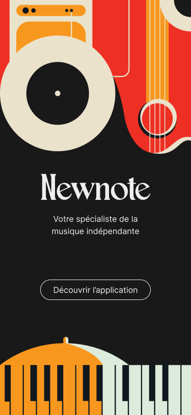
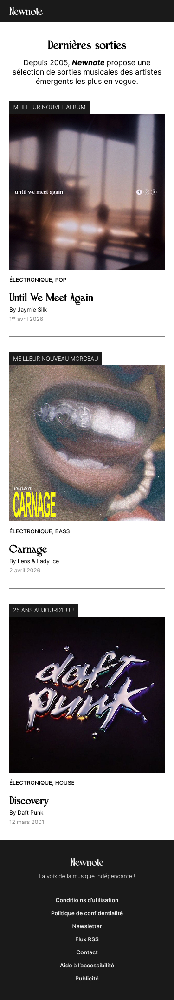
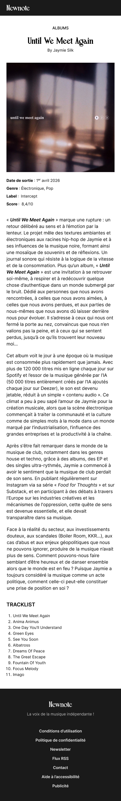

# CPW - CSS : Dossier de juin 2026

## Indifie

Vous trouverez dans ce dossier trois pages HTML nommées [**index.html**](./index.html), [**home.html**](./html/home.html), [**album.html**](./html/album.html). Vous disposez de tout le matériel nécessaire pour réaliser cet exercice dans les dossiers suivants : **img**, **fonts** et **rendus**.

Le rendu final attendu est illustré ci-dessous : 

- 
- 
- 

### Consignes

* Liez le fichier **reset.css** d'[Eric Meyer](https://meyerweb.com/eric/tools/css/reset/) aux différentes pages HTML.
* En vous appuyant sur les rendus attendus dans le fichier Figma, complétez les feuilles de styles CSS.
* Les polices utilisées sont Inter et Palmito. Elles sont disponibles dans le dossier **fonts**.

### Outils

- [css-steptools](https://github.com/tecg-cpw/css-steptools)

Adaptation et intégration par [François Parmentier](https://github.com/fprms).
